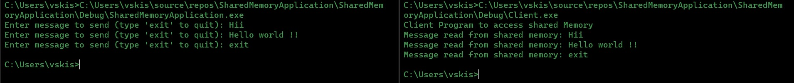

# SharedMemoryApplication

## Sharing memory between 2 processes

Using FileMapping method of windows we use system pages to share memory between 2 processes

##### ------------------------- OUTPUT ------------------------------

